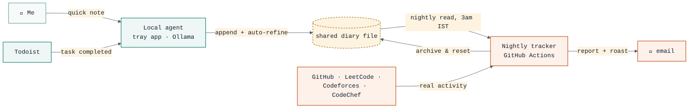

# What I'm building right now

**Goal:** get genuinely strong at HLD and LLD, so I can walk into full-stack
interviews with confidence and solid projects behind me.

Instead of one big tool, I split the problem into two small agents that don't
share any code — only one file. (Both live in private repos, so this page
gives the overview rather than the exact source.)

**[→ Interactive walkthrough](https://arnav-kadu.github.io/WhatAmIBuildingCurrently/)**
of the daily cycle, click-through.

- **A local capture agent** &mdash; runs on my machine, watches what I actually
  do, and keeps a diary of it. Local model (Ollama), zero API cost, zero
  cloud dependency.
- **A nightly tracker** &mdash; runs once a day in the cloud, reads that diary
  plus my real GitHub/LeetCode/Codeforces activity, and emails me a report.
  Encouraging if I showed up. A roast if I didn't.

## How the two connect

The shared diary file is the entire interface between them. The local agent
only ever writes to it; the tracker only ever reads it, archives it, and
resets it for the next day. Neither project imports the other's code.

## The split, in more detail

| | Local agent | Nightly tracker |
|---|---|---|
| **Runs** | Always, in the system tray | Once nightly, GitHub Actions (3am IST) |
| **Model** | Local (Ollama), free | Cloud (OpenRouter), cheap |
| **Job** | Capture what I do, trim it, hand it off | Judge it: streaks, priority-ordered curriculum, roast tone |
| **Can't do** | Judge progress, edit its own code | Know what I'm doing right now |

## Ground rules

- **Data-only autonomy** &mdash; the local agent can append to the diary, read
  it, and poll Todoist. Nothing else. No shell access, no self-editing.
- **Never destructive** &mdash; auto-refine only replaces raw diary entries if
  the local model returns something real. Any failure just leaves the raw
  notes alone.
- **Deterministic core, LLM garnish** &mdash; the tracker's coding-activity and
  study-progress sections are plain code, never LLM-dependent. Only the
  closing feedback line touches a model, with a plain-text fallback if that
  output looks broken.
- **One shared file, not shared code** &mdash; no imports between the two
  projects, on purpose.

---
*Last updated 2026-07-23.*
